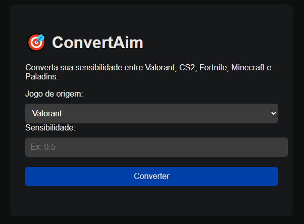

# 🎯 ConvertAim  

  

## 📌 About the project  
**ConvertAim** is a simple and practical tool to **convert sensitivities between different games**.  
It helps players keep a consistent experience when switching between FPS games, without having to calculate everything manually.  

🔗 **Live demo:**  
👉 [ConvertAim on GitHub Pages](https://MauroSwt.github.io/ConvertAim/)  

---

## 🚀 Tech stack  
- **HTML5** → Application structure  
- **CSS3** → Styling and layout  
- **JavaScript** → Conversion logic and interactivity  

---

## 🖼️ Project preview  
(Add a screenshot named `preview.png` in the root of the repository to show it here)  
Example:  

  

---

## 📂 Project structure  
```bash
├── index.html   # Main page
├── style.css    # App styles
├── script.js    # JavaScript functionalities
└── README.md    # Project documentation
